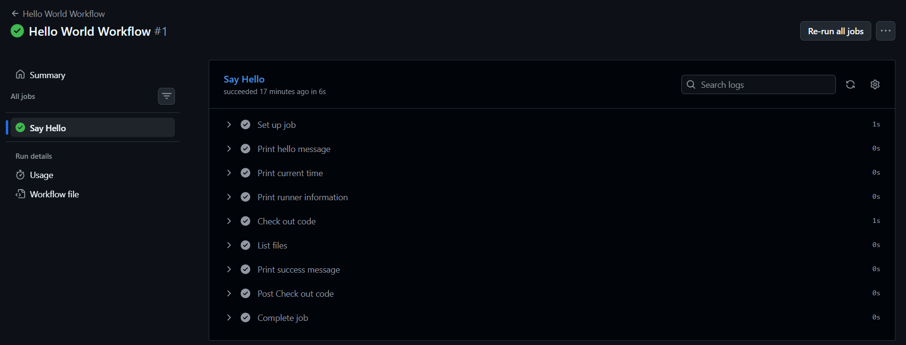
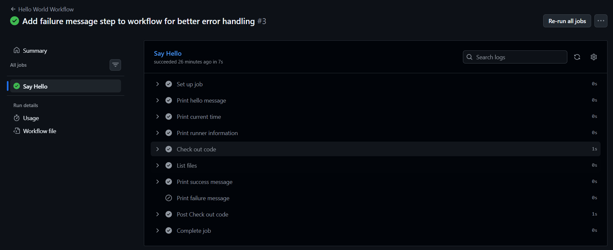
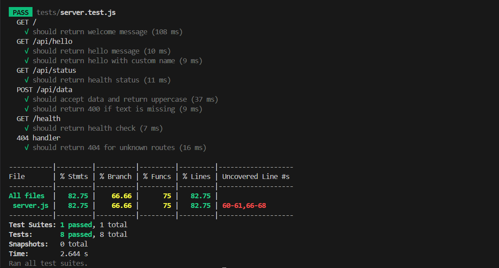
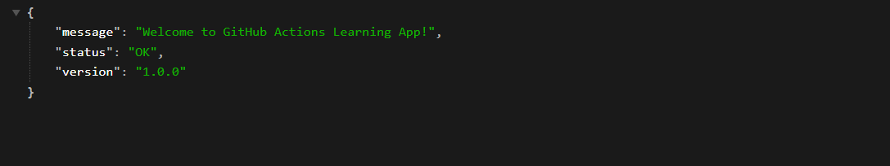
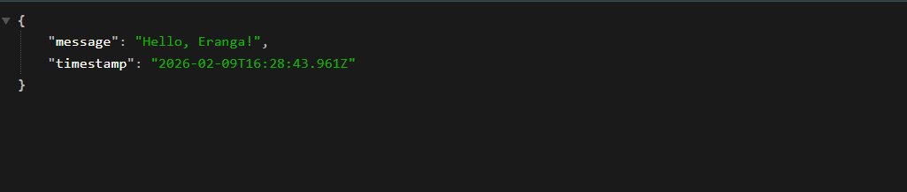
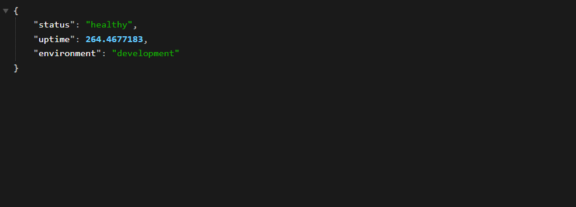
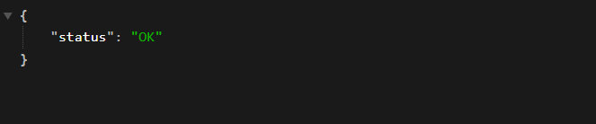

## Task 1: trigger workflows manually



## Task 2: Understand Workflow Triggers


- add failure trigger. It's not work because of that. workflow file is working correctly

## Task 3: Build and Test Locally

Objective: Run the sample app and tests locally

```bash
cd sample-app
npm install
npm test
npm start


```
-------

Output: `npm test`



--------

Output: `http://localhost:3000`



---------

Output: `http://localhost:3000/api/hello?name=Eranga`



----------

Output: `http://localhost:3000/api/status`



----------

Output: `http://localhost:3000/health`



